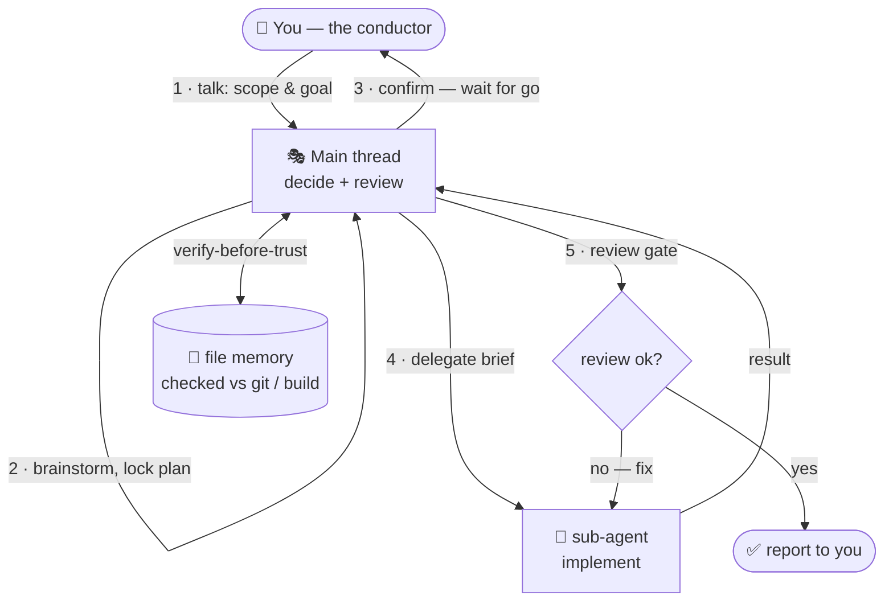
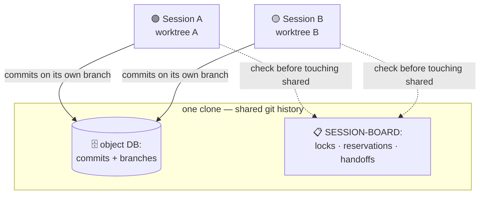

# claude-conductor

> Every new Claude Code session forgets your project, sometimes says "done" when it isn't, and — if you run more than one — quietly overwrites the others. **claude-conductor** is the discipline that fixes all three.

**A portable operating system for working with [Claude Code](https://www.anthropic.com/claude-code).**
It packages three things that make Claude behave like a disciplined teammate across
sessions and across projects.

## The three pillars

- **🎭 Orchestrator workflow** — the main Claude thread decides and reviews; sub-agents implement. Nothing ships without passing a review gate, and Claude confirms the plan before changing anything — so you stop catching "finished" work that was never finished.
- **🗂️ Multi-session coordination, no collisions** — run many Claude sessions in parallel on the same project without overwriting each other. Each works in its own isolated git worktree and coordinates through a shared session board (locks, reservations, handoffs). Collisions are prevented by that isolation plus Claude Code's built-in modified-since-read edit guard — structured discipline you follow, not auto-enforcement.
- **🔍 Verify-before-trust memory** — Claude remembers project state across sessions in size-budgeted files (no more re-explaining), but checks that memory against reality (git, build, infra) before believing it. Remembered facts get verified, not blindly trusted.

It also routes context to the right business unit (corporate HQ, each brand, each
separate business) automatically by keyword/cwd, so multi-workspace setups stay
isolated.

## How it works

Two flows do most of the work — the orchestrator loop (per task) and multi-session coordination (when you run several at once):

**The orchestrator loop — per task**



**Multi-session — parallel, no collisions**



This is the **sanitized public framework**. It contains the reusable mechanics only —
no business data. The maintainer keeps a private instance (with real workspaces and
project memory); this fork strips all of that out and replaces every concrete example
with a fictional one (`AcmeCorp`, `example.com`, placeholders).

> **Start here → [`docs/00-orientation.md`](docs/00-orientation.md)**

> **Language note:** this README is the English entry point. The operational/deep
> docs — `CLAUDE.md`, the guides under `docs/`, and the `commands/` definitions — are
> written primarily in Thai (that is the maintainer's working language). The mechanics
> are language-agnostic; translate the prose to your own language when you adopt it.

---

## Quick start (2 minutes)

Try the framework on your machine (Windows/PowerShell shown; the System layer is the
reusable Layer 1 — `CLAUDE.md`, `MEMORY_SCHEME.md`, `settings.json`, `commands/`,
`hooks/`, `templates/`, `docs/`):

```powershell
git clone <this-repo-url> claude-conductor
cd claude-conductor
./setup.ps1            # dry-run summary first, then asks before copying into ~/.claude
```

`setup.ps1` derives your home-path segment automatically, substitutes the
`<YOUR_HOME>` / `C--Users-you` placeholders, and copies the System layer into
`~/.claude/` (it backs up or skips anything that already exists). Then start a new
Claude Code session — the SessionStart hook loads matching project memory.

> Want to do it by hand or understand each step? See
> [How to adopt it for your business](#how-to-adopt-it-for-your-business) below.

---

## The 3-layer model

The system separates content by how portable and how sensitive it is:

| Layer | What | In this public repo? |
|---|---|---|
| **1. System** | Mechanics / rules that work for anyone, not tied to a business | ✅ `CLAUDE.md`, `MEMORY_SCHEME.md`, `commands/`, `hooks/`, `settings.json` |
| **2. Knowledge** | *Your* business context + project memory | ❌ not included — you create it from `templates/` (see `examples/` for the shape) |
| **3. Machine-secret** | Credentials + per-machine runtime state | ❌ gitignored, lives only in `~/.claude` (see `.env.example`) |

Layer 1 is what this framework gives you. Layer 2 is what *you* fill in. Layer 3 never
touches git.

---

## Repo map

```
claude-conductor/
├── README.md                      ← you are here
├── LICENSE                        ← MIT license
├── .gitignore                     ← keeps secrets out of git
├── .env.example                   ← machine-specific values a new machine must supply
├── setup.ps1                      ← installer: copies System layer into ~/.claude + fixes placeholders
├── CLAUDE.md                      ← [System] global rules + workspace registry + cwd mapping (template)
├── MEMORY_SCHEME.md               ← [System] memory system reference + templates + verify recipes
├── settings.json                  ← [System] Claude CLI hooks (PreCompact / SessionEnd / SessionStart)
├── commands/                      ← [System] slash-command definitions (/memory-recall, /memory-save)
├── hooks/                         ← [System] memory checkpoint hooks (Node.js)
├── docs/                          ← documentation, read in order 00 → 05
├── templates/                     ← reusable templates (project/workspace CLAUDE.md, memory file, verify recipes)
└── examples/                      ← a fictional filled-in instance (AcmeCorp) to copy from
    ├── workspaces/acme-corp/CLAUDE.md
    └── memory/{MEMORY.md, project-acme-web.md}
```

---

## How to adopt it for your business

1. **Clone / copy** the System layer into your Claude config dir:
   - Put `CLAUDE.md`, `MEMORY_SCHEME.md`, `settings.json`, `commands/`, `hooks/` under `~/.claude/`.
2. **Fix the machine-specific bits:**
   - In `hooks/memory-checkpoint.js` and the `~/.claude/projects/...` paths, replace the
     `C--Users-you` segment with the one derived from *your* home path (Claude turns
     `C:\Users\alice` into `C--Users-alice`).
   - In `settings.json`, replace `<YOUR_HOME>` in the hook commands with your real home path.
3. **Fill in your Knowledge layer** using `templates/` + `examples/` as a guide:
   - Create `~/.claude/workspaces/<name>/CLAUDE.md` for each business unit
     (start from `templates/workspace-CLAUDE.md.template`; see `examples/workspaces/acme-corp/`).
   - Create `~/.claude/projects/<your-home-segment>/memory/MEMORY.md` (index) and one
     `project-<name>.md` per project (start from `templates/project-memory.md.template`;
     see `examples/memory/`).
   - Update the **Workspace Registry** and **Project mapping** tables in `CLAUDE.md` to
     point at your real workspaces and projects.
4. **Supply secrets locally** — copy `.env.example` → `.env` and fill values. Never commit it.
5. **Keep your Knowledge layer private** — if you version-control your filled-in instance,
   use a private repo. Only the framework (this repo) is meant to be public.

---

## Security note

- This public repo contains **no real business data** — every workspace, project, domain,
  IP, and name in it is fictional or a placeholder.
- **Secrets are never committed.** `.gitignore` blocks `.credentials.json`,
  `*.local.json`, `**/credentials*.json`, `.env`, etc. All real secrets/runtime state
  live only in `~/.claude`.
- If you fork this and fill it with your own business context, **keep that fork private**.

---

## Where to go next

1. [`docs/00-orientation.md`](docs/00-orientation.md) — big picture, the 3-layer model, example workspaces/projects
2. [`docs/01-orchestrator-workflow.md`](docs/01-orchestrator-workflow.md) — the mandatory 5-step way of working
3. [`docs/02-memory-protocol.md`](docs/02-memory-protocol.md) — how file-based memory works
4. [`docs/03-inter-session.md`](docs/03-inter-session.md) — coordinating parallel sessions
5. [`docs/04-onboarding-new-project.md`](docs/04-onboarding-new-project.md) — adding a project/workspace
6. [`docs/05-public-fork-plan.md`](docs/05-public-fork-plan.md) — how this sanitized fork is produced from a private instance
