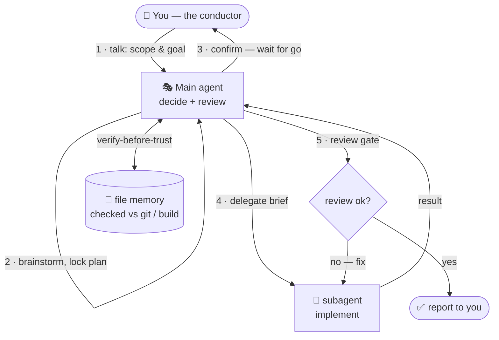
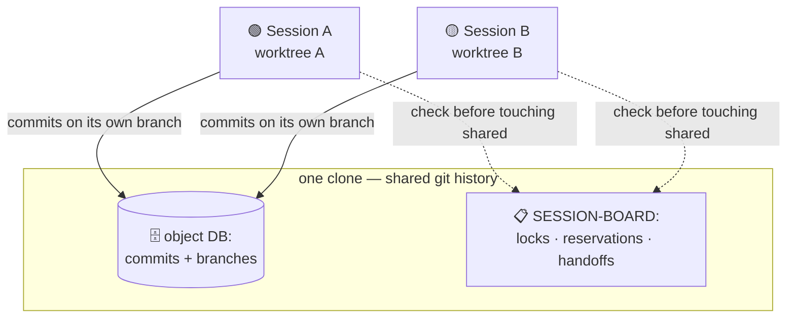

# claude-conductor

> Every new AI coding session forgets your project, sometimes says "done" when it isn't, and — if you run more than one — quietly overwrites the others. **claude-conductor** is the discipline that fixes all three.

**A portable operating system for working with AI coding agents — [Claude Code](https://www.anthropic.com/claude-code) and [OpenAI Codex](https://github.com/openai/codex).**
One agent-neutral rule set (`AGENTS.md`), shared skills and a shared memory protocol make the
agent behave like a disciplined teammate across sessions and across projects — a teammate on
Codex gets the same system as one on Claude Code.

## The three pillars

- **🎭 Orchestrator workflow** — the main agent decides and reviews; subagents implement. Nothing ships without passing a review gate, and the agent confirms the plan before changing anything — so you stop catching "finished" work that was never finished.
- **🗂️ Multi-session coordination, no collisions** — run many sessions in parallel on the same project without overwriting each other. Each works in its own isolated git worktree and coordinates through a shared session board (locks, reservations, handoffs). Structured discipline you follow, not auto-enforcement.
- **🔍 Verify-before-trust memory** — the agent remembers project state across sessions in size-budgeted files (no more re-explaining), but checks that memory against reality (git, build, infra) before believing it. Remembered facts get verified, not blindly trusted.

It also routes context to the right business unit (corporate HQ, each brand, each
separate business) by keyword/cwd, so multi-workspace setups stay isolated.

## How it works

Two flows do most of the work — the orchestrator loop (per task) and multi-session coordination (when you run several at once):

**The orchestrator loop — per task**


```mermaid
flowchart TD
    U(["🧑 You — the conductor"])
    U -->|"1 · talk: scope & goal"| MT["🎭 Main agent<br/>decide + review"]
    MT -->|"2 · brainstorm, lock plan"| MT
    MT -->|"3 · confirm — wait for go"| U
    MT -->|"4 · delegate brief"| AG["🤖 subagent<br/>implement"]
    AG -->|"result"| MT
    MT -->|"5 · review gate"| G{"review ok?"}
    G -->|"no — fix"| AG
    G -->|"yes"| DONE(["✅ report to you"])
    MT <-->|"verify-before-trust"| MEM[("📓 file memory<br/>checked vs git / build")]
```

**Multi-session — parallel, no collisions**


```mermaid
flowchart TD
    subgraph ONE["one clone — shared git history"]
        OBJ[("🗄️ object DB:<br/>commits + branches")]
        BOARD["📋 SESSION-BOARD:<br/>locks · reservations · handoffs"]
    end
    SA["🟢 Session A<br/>worktree A"]
    SB["🟡 Session B<br/>worktree B"]
    SA -->|"commits on its own branch"| OBJ
    SB -->|"commits on its own branch"| OBJ
    SA -.->|"check before touching shared"| BOARD
    SB -.->|"check before touching shared"| BOARD
```

This is the **sanitized public framework**. It contains the reusable mechanics only —
no business data. The maintainer keeps a private instance (with real workspaces and
project memory); this fork strips all of that out and replaces every concrete example
with a fictional one (`AcmeCorp`, `example.com`, placeholders).

> **Start here → [`docs/00-orientation.md`](docs/00-orientation.md)** · Codex users: [`docs/07-codex.md`](docs/07-codex.md)

> **Language note:** the agent-facing core — `AGENTS.md`, `skills/`, `codex/agents/` — is
> written in English so every agent reads the same rules. The human guides under `docs/` are
> written primarily in Thai (the maintainer's working language); the mechanics are
> language-agnostic.

---

## Quick start (2 minutes)

Windows / PowerShell shown. Both installers print a dry-run summary first, ask before
copying, back up or skip anything that already exists, and fill the path tokens
(`{{AGENT_HOME}}`, `{{MEMORY_DIR}}`, `{{SKILLS_DIR}}`) with your real paths.

**Claude Code**

```powershell
git clone <this-repo-url> claude-conductor
cd claude-conductor
.\setup.ps1            # -> ~/.claude (AGENTS.md + CLAUDE.md, settings.json hooks, skills, docs, templates)
```

Then start a new Claude Code session — the SessionStart hook loads matching project memory.

**OpenAI Codex**

```powershell
git clone <this-repo-url> claude-conductor
cd claude-conductor
.\setup-codex.ps1      # -> ~/.codex (AGENTS.md, hooks.json, agents/) + ~/.agents/skills
```

Then paste the `writable_roots` snippet it prints into `~/.codex/config.toml`, open `codex`,
run `/hooks` and trust the conductor hooks, and follow the smoke test in
[`docs/07-codex.md`](docs/07-codex.md).

> Want to do it by hand or understand each step? See
> [How to adopt it for your business](#how-to-adopt-it-for-your-business) below.

---

## The 3-layer model

The system separates content by how portable and how sensitive it is:

| Layer | What | In this public repo? |
|---|---|---|
| **1. System** | Mechanics / rules that work for anyone, not tied to a business | ✅ `AGENTS.md`, `CLAUDE.md`, `MEMORY_SCHEME.md`, `skills/`, `hooks/`, `settings.json`, `codex/` |
| **2. Knowledge** | *Your* business context + project memory | ❌ not included — you create it from `templates/` (see `examples/` for the shape) |
| **3. Machine-secret** | Credentials + per-machine runtime state | ❌ gitignored, lives only in the agent's home dir (see `.env.example`) |

Layer 1 is what this framework gives you. Layer 2 is what *you* fill in. Layer 3 never
touches git.

---

## Repo map

```
claude-conductor/
├── README.md                      ← you are here
├── LICENSE                        ← MIT license
├── .gitignore                     ← keeps secrets out of git
├── .env.example                   ← machine-specific values a new machine must supply
├── setup.ps1                      ← Claude Code installer: System layer -> ~/.claude + path tokens
├── setup-codex.ps1                ← Codex installer: System layer -> ~/.codex + ~/.agents/skills + path tokens
├── AGENTS.md                      ← [System] agent-neutral global rules + workspace registry + cwd mapping (template)
├── CLAUDE.md                      ← [System] Claude Code: `@AGENTS.md` + Claude-only specifics
├── MEMORY_SCHEME.md               ← [System] memory system reference + templates + verify recipes
├── settings.json                  ← [System] Claude Code hooks (PreCompact / SessionEnd / SessionStart / PostToolUse)
├── codex/                         ← [System] Codex: hooks.json + agents/{planner,reviewer,worker-heavy,worker-light}.toml
├── hooks/                         ← [System] memory hooks (Node.js): checkpoint + guard (both agents) + extract (Claude only)
├── skills/                        ← [System] shared skills: memory-save, memory-recall, memory-consolidate, orchestrated-loop, ship
├── docs/                          ← documentation, read in order 00 → 07
├── templates/                     ← project/workspace AGENTS.md, memory file, MEMORY.md + SESSION-BOARD.md seeds, verify recipes
└── examples/                      ← a fictional filled-in instance (AcmeCorp) to copy from
    ├── workspaces/acme-corp/AGENTS.md
    └── memory/{MEMORY.md, project-acme-web.md, feedback-*.md}
```

---

## How to adopt it for your business

1. **Install the System layer** with `setup.ps1` (Claude Code) and/or `setup-codex.ps1` (Codex).
   By hand: copy the files listed in the installer's header and replace the three path tokens
   with your real paths — agent home (`~/.claude` or `~/.codex`), memory dir
   (`~/.claude/projects/<slug>/memory` or `~/.codex/conductor-memory`), skills dir
   (`~/.claude/skills` or `~/.agents/skills`).
2. **Fill in your Knowledge layer** using `templates/` + `examples/` as a guide:
   - Create `<agent home>/workspaces/<name>/AGENTS.md` for each business unit
     (start from `templates/workspace-AGENTS.md.template`; see `examples/workspaces/acme-corp/`).
   - Fill the seeded `MEMORY.md` in your memory dir and add one `project-<name>.md` per project
     (start from `templates/project-memory.md.template`; see `examples/memory/`).
   - Update the **Workspace registry** and **Project mapping** tables in the installed `AGENTS.md`,
     and `PROJECT_MEMORY_MAP` in the installed `hooks/memory-checkpoint.js`.
   - Give each project root an `AGENTS.md` (`templates/project-AGENTS.md.template`) plus, for
     Claude Code, a one-line `CLAUDE.md` containing `@AGENTS.md`.
3. **Supply secrets locally** — copy `.env.example` → `.env` and fill values. Never commit it.
4. **Keep your Knowledge layer private** — if you version-control your filled-in instance,
   use a private repo. Only the framework (this repo) is meant to be public.

---

## Security note

- This public repo contains **no real business data** — every workspace, project, domain,
  IP, and name in it is fictional or a placeholder.
- **Secrets are never committed.** `.gitignore` blocks `.credentials.json`,
  `*.local.json`, `**/credentials*.json`, `.env`, etc. All real secrets/runtime state
  live only in the agent's home dir.
- If you fork this and fill it with your own business context, **keep that fork private**.

---

## Where to go next

1. [`docs/00-orientation.md`](docs/00-orientation.md) — big picture, the 3-layer model, example workspaces/projects
2. [`docs/01-orchestrator-workflow.md`](docs/01-orchestrator-workflow.md) — the mandatory 5-step way of working (+ the role-routed `orchestrated-loop` and `ship` skills)
3. [`docs/02-memory-protocol.md`](docs/02-memory-protocol.md) — how file-based memory works
4. [`docs/03-inter-session.md`](docs/03-inter-session.md) — coordinating parallel sessions (board, deploy lock, handoff queue, merge hygiene)
5. [`docs/04-onboarding-new-project.md`](docs/04-onboarding-new-project.md) — adding a project/workspace
6. [`docs/05-public-fork-plan.md`](docs/05-public-fork-plan.md) — how this sanitized fork is produced from a private instance
7. [`docs/06-lessons-learned.md`](docs/06-lessons-learned.md) — problems hit in real use → the rule each one produced
8. [`docs/07-codex.md`](docs/07-codex.md) — Claude Code ↔ Codex mapping, install, smoke test

---

*Last updated: 2026-10-09*
